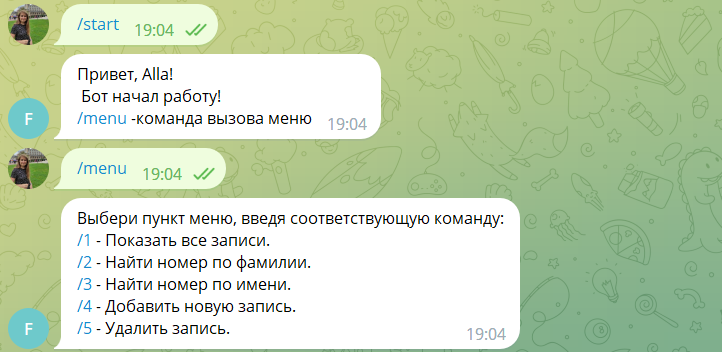
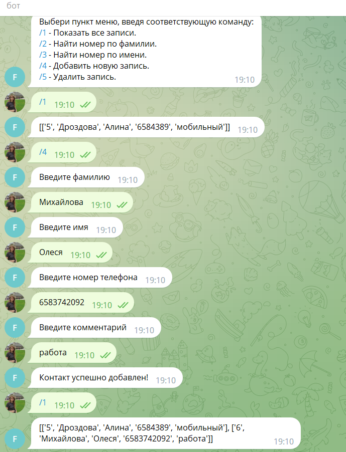
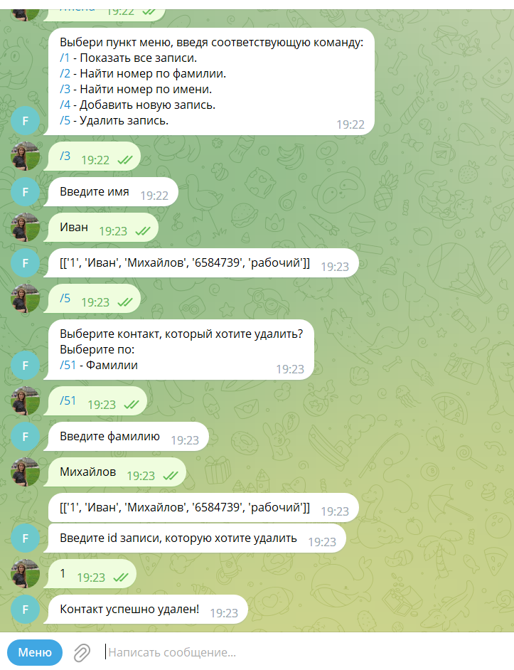
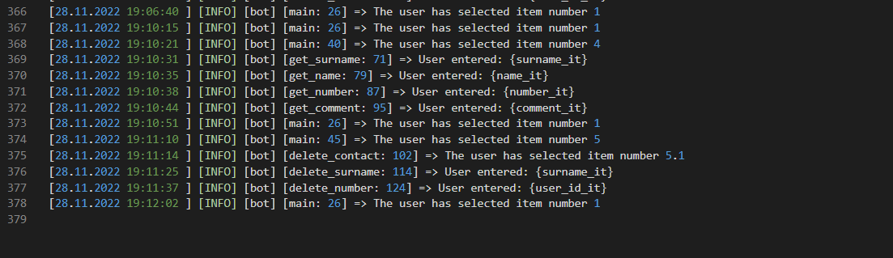

# Телеграм-бот телефонный справочник (элементарный)

Меню включает такие возможности, см ниже:



## Для реализации текущих задач использовала библиотеки:

`telebot`

Необходимо настроить окружение -- ввести в консоле команды поочередно:
```python
pip install telebot
pip install PyTelegramBotAPI==2.2.3
pip install PyTelegramBotAPI==3.6.7

# вот так устанавливаем библиотеки 
```
Чтобы успешно использовать телеграм-бот, необходимо в 5 строке модуля bot.py добавить индивидуальный токен телеграм-бота (прилагаю [инструкцию](https://core.telegram.org/bots))

## Пример реализации меню:

```python
@bot.message_handler(commands=['start'])
def start(message):
    bot.send_message(
        message.chat.id, f'Привет, {message.from_user.first_name}!\n Бот начал работу! \n/menu -команда вызова меню')

@bot.message_handler(content_types=['text'])
def main(message):
    if message.text == '/menu':
        bot.send_message(message.chat.id, f'Выбери пункт меню, введя соответствующую команду: \n/1 - Показать все записи.\n/2 - Найти номер по фамилии.\n/3 - Найти номер по имени.\n/4 - Добавить новую запись.\n/5 - Удалить запись.')
        cr.init_book('phonebook.csv')

    elif message.text == '/1':
        lg.logging.info('The user has selected item number 1')
        bot.send_message(message.chat.id, f'{cr.extract_data()}')

    elif message.text == '/2':
        lg.logging.info('The user has selected item number 2')
        bot.send_message(message.chat.id, f'Введите фамилию')
        bot.register_next_step_handler(message, find_surname)

# и так далее                
```

## Модуль create_durectory

В модуле находятся функции, которые отвечают за создание, чтение и удаление информации из телефонной книги.

Например, функция создание контакта:
```python
def create_contact(surname='', name='', number='', comment=''):
    global id
    global BD
    global file_BD
    id += 1
    new_row = [str(id), surname.title(), name.title(), number, comment.lower()]
    BD.append(new_row)
    with open(file_BD, 'a', newline='') as fh:
        writer = csv.writer(fh, delimiter=',',
                            quotechar='\'', quoting=csv.QUOTE_MINIMAL)
        writer.writerow(new_row)

# импортирую в модуль bot.py и использую
def get_surname(message):
    global surname_it
    surname_it = message.text
    lg.logging.info('User entered: {surname_it}')
    bot.send_message(message.chat.id, f'Введите имя')
    bot.register_next_step_handler(message, get_name)


def get_name(message):
    global name_it
    name_it = message.text
    lg.logging.info('User entered: {name_it}')
    bot.send_message(message.chat.id, f'Введите номер телефона')
    bot.register_next_step_handler(message, get_number)

    
def get_number(message):
    global number_it
    number_it = message.text
    lg.logging.info('User entered: {number_it}')
    bot.send_message(message.chat.id, f'Введите комментарий')
    bot.register_next_step_handler(message, get_comment)


def get_comment(message):
    global comment_it
    comment_it = message.text
    lg.logging.info('User entered: {comment_it}')
    cr.create_contact( name_it, surname_it, number_it, comment_it)
    bot.send_message(message.chat.id, f'Контакт успешно добавлен!')        
```


## Также реализована возможность удаления контакта, ниже результат работы :




## Модуль логирования

Данный модуль предназначен для записи и хранения действий пользователя. Мы записываем действия, выполненные пользователем в определенное время:

```python
# небольшой фрагмент 
import logging

logging.basicConfig(
    level=logging.INFO,
    filename='calculatorbook.log',
    format='[%(asctime)s] [%(levelname)s] [%(module)s] [%(funcName)s: %(lineno)d] => %(message)s',
    datefmt='%d.%m.%Y %H:%M:%S ',
) 
```  
Например, вывод после выполнения:
